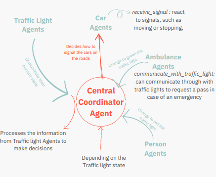

# Traffic Simulation
Assignment of the course Introduction to Intelligent and Autonomous Systems (3rd year, 1st semester)

## A little context
### Overview
The aim is to design and implement a multi-agent system to efficiently
manage traffic across multiple intersections. The agents should
communicate with each other and coordinate to manage traffic signals,
aiming to minimize waiting times and enhance traffic flow.

### Objective
* Implement intelligent traffic light agents that can adapt to real-time traffic conditions.
* Usage of vehicle agents that generate simplified but realistic traffic patterns
* Integration of the agents to work in a coordinated way to optimize traffic flow

### Overall sketch of the environment and agents representation

### Interaction and communication protocols
* Spade
* Types of messages: Inform and Request
* Asynchronous communication: Agents utilize asynchronous communication, ensuring non-blocking interactions
* Timout Handling: Message reception includes timeout handling, enhancing the system's responsiveness

### What's happening?

### How to interpret the cmd?

